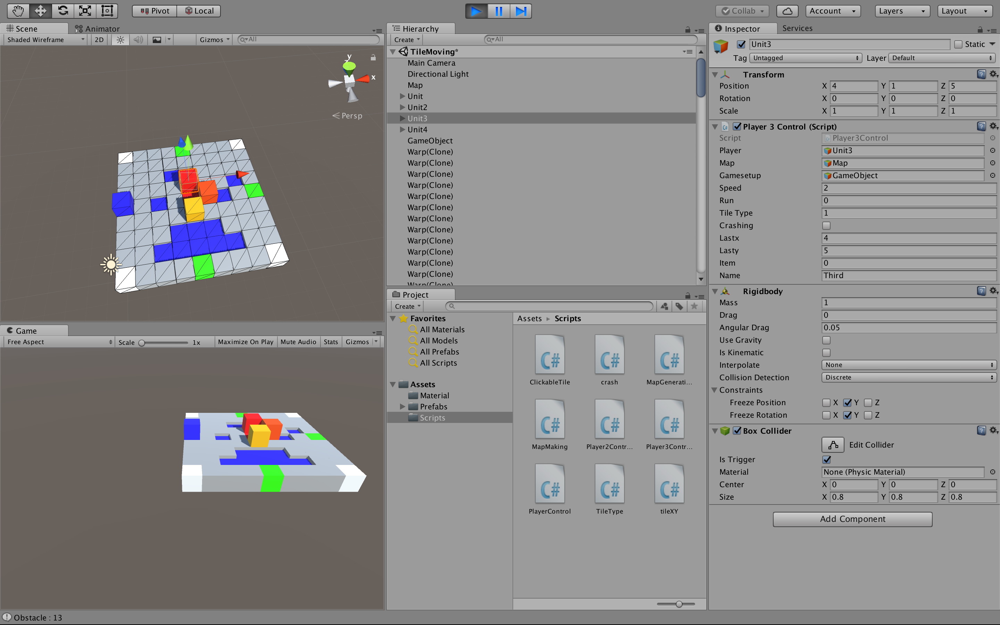
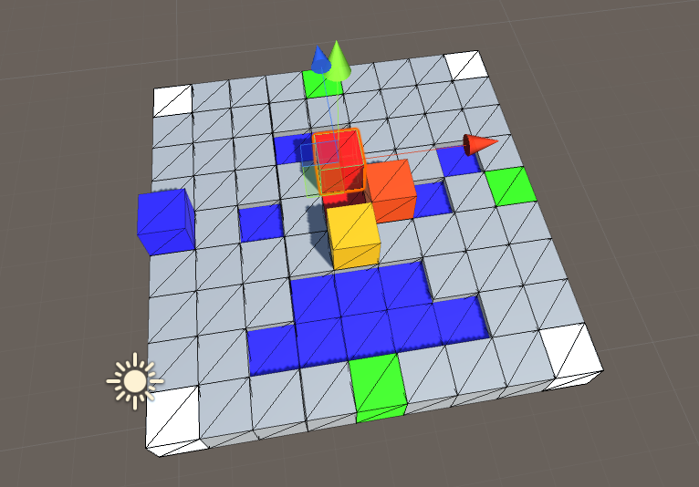
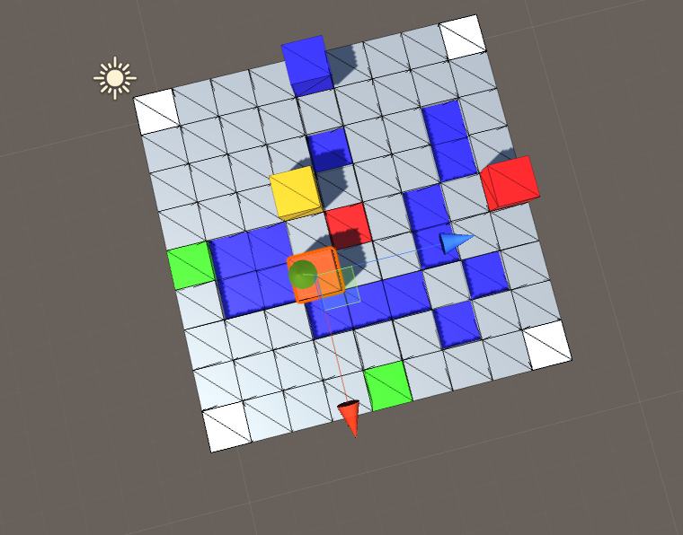
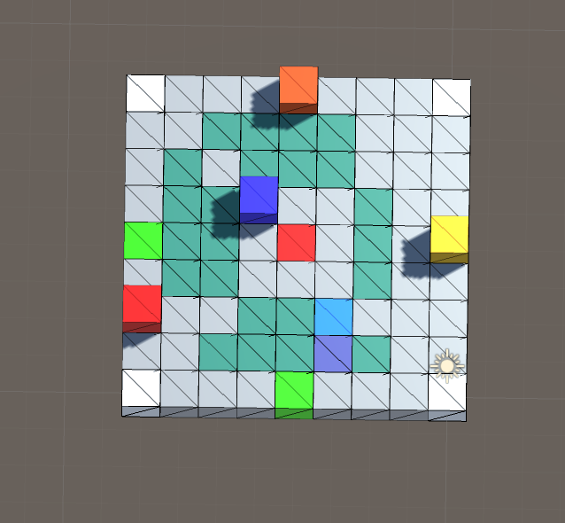
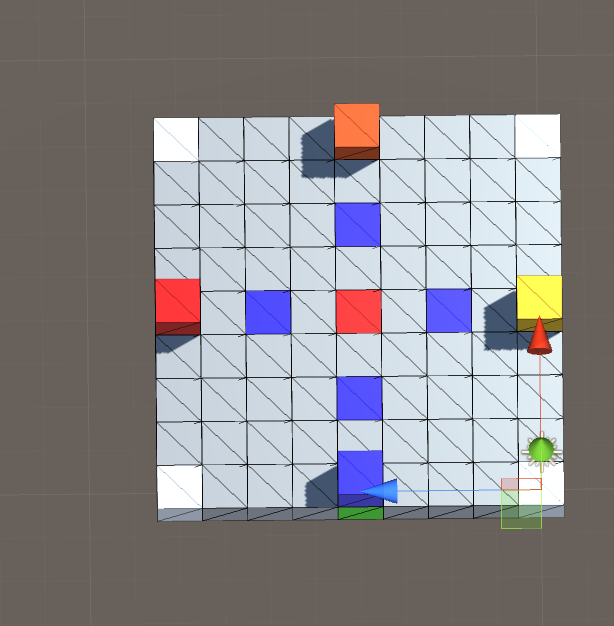
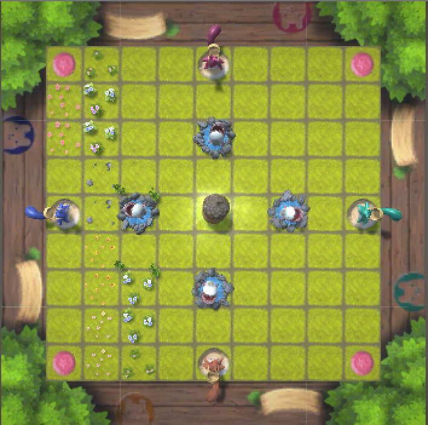
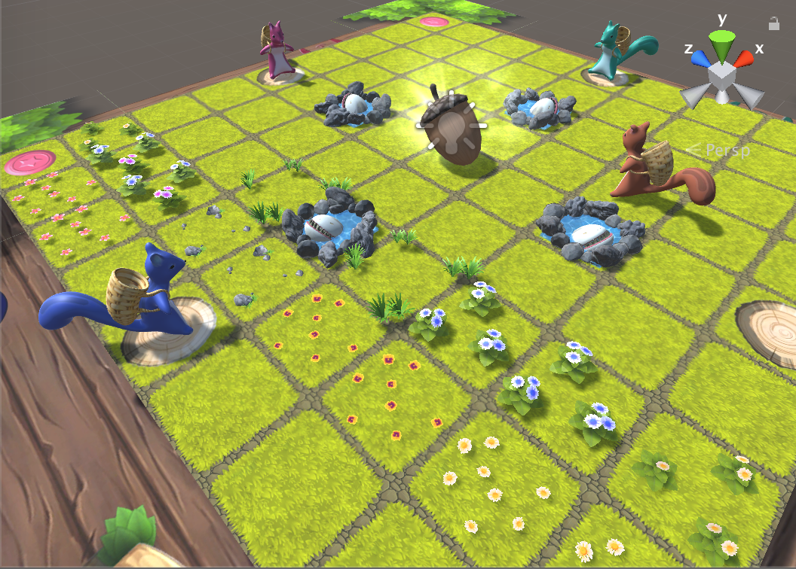
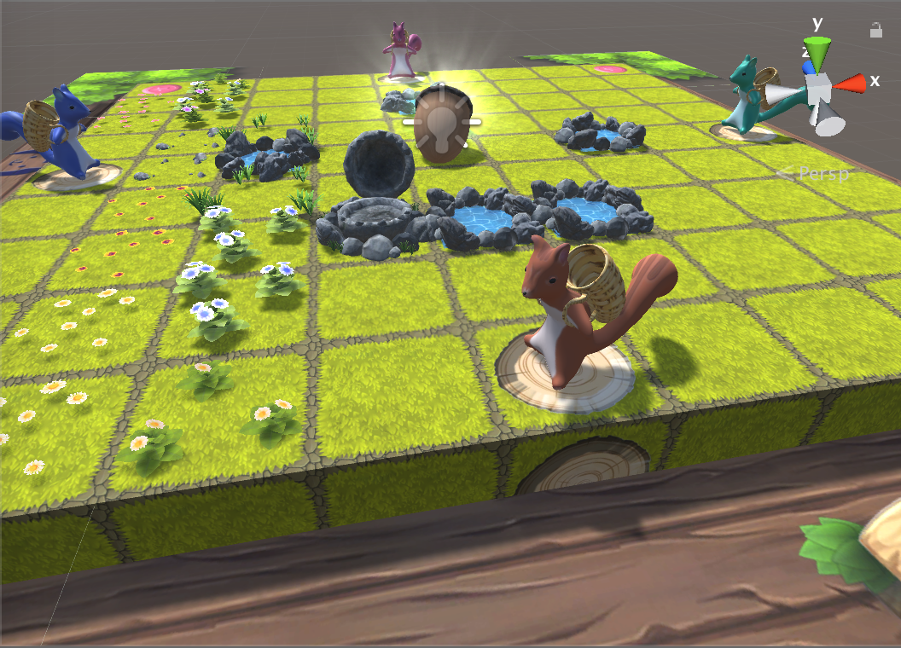
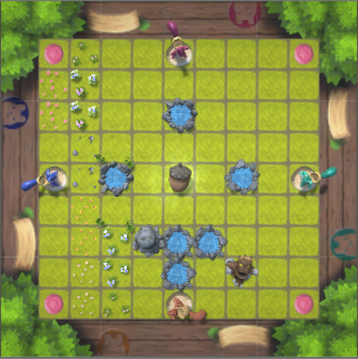

# KidsMaru
Playing with Kids maru

### This Step is making rule of the Tile map

This part is description of how to game works.
Basically this game is moved by arduino equipments.
The serial port is used but this part didn't write about it.

### First description

this Game is made of 81 tiles prefabs.
and there are many kind of tiles in this game.
also you can notice that there are many kind of obstacle too.

### Second description

User who playing this game can play together. (max player is 4)
then player gather the arcon so if player's arcon storage is full,
The player's zone is reset and game will begin.

### Third description

there are unique part of area in this Game.
that is Warp. if player in the warp, the player's position will be random.

## Screen shot

